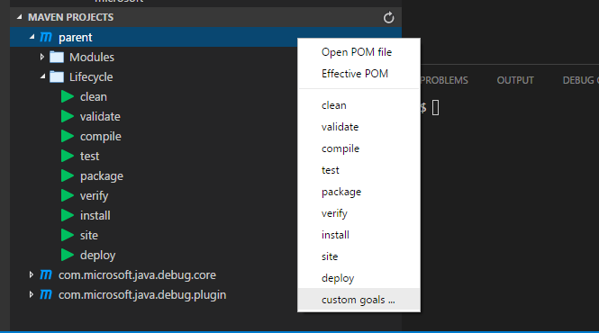
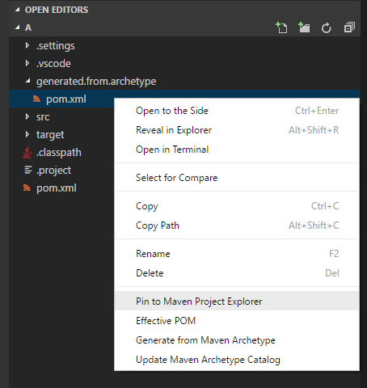

# Maven Project Explorer

[](https://marketplace.visualstudio.com/items?itemName=eskibear.vscode-maven) [](https://marketplace.visualstudio.com/items?itemName=eskibear.vscode-maven) [](https://marketplace.visualstudio.com/items?itemName=eskibear.vscode-maven) [](https://travis-ci.org/Eskibear/vscode-maven)

## Features

Maven extension for VS Code. It now reads `pom.xml` in root folder, and provide project structures in sidebar, improving user experience for Java developers who use Maven.

* Effective POM
* Shortcut to common goals, namely `clean`, `validate`, `compile`, `test`, `package`, `verify`, `install`, `site`, `deploy`.
* Perserve history of custom goals for fast re-run long commands(e.g. `mvn clean package -DskipTests -Dcheckstyle.skip`).
* Can generate projects from Maven Archetype.
* Support multi-module maven projects.
* Support VSCode multi-root workspace.

## Requirements

Maven installed and PATH added, i.e., `mvn` command can be executed directly in the terminal.

## Usage

* The extension scans `pom.xml` from each root folder in your workspace recursively, and display corresponding projects and their modules in the sidebar.

    

* If you want to add a project whose `pom.xml` is elsewhere not in the workspace, you have multiple ways to import it.
    * `right-click` on the `pom.xml`, select `Import Maven Project`. The extension will force to show the corresponding project in sidebar.
    * Or simply click the `+` button, and select a `pom.xml` in a system dialog.
    * Or you just want to search `pom.xml` files recursively and import all of them. Then click the folder-shaped button beside.

    


    In fact, the extension imports a Maven project by adding its absolute path in your `Workspace Settings`, and then refreshes the whole view.
    ```
    {
        "maven.projects.pinnedPomPaths": [
            "c:\\path-to-project\\pom.xml"
        ]
    }
    ```
* It perserves history of custom goals for each project, so you can fast re-run previous long commands, e.g. `mvn <goals> -Dparam1=value1 -Dparam2=value2 -Dparam3=value3 ...` 

    

* Archetype Related
    * **Generate from Maven Archetype** The extension loads archetypes listed in local/remote catelog. After selection, the extension fires `mvn archetype:generate -D...` in terminal.

    

## Release Notes

Refer to [CHANGELOG](CHANGELOG.md)
