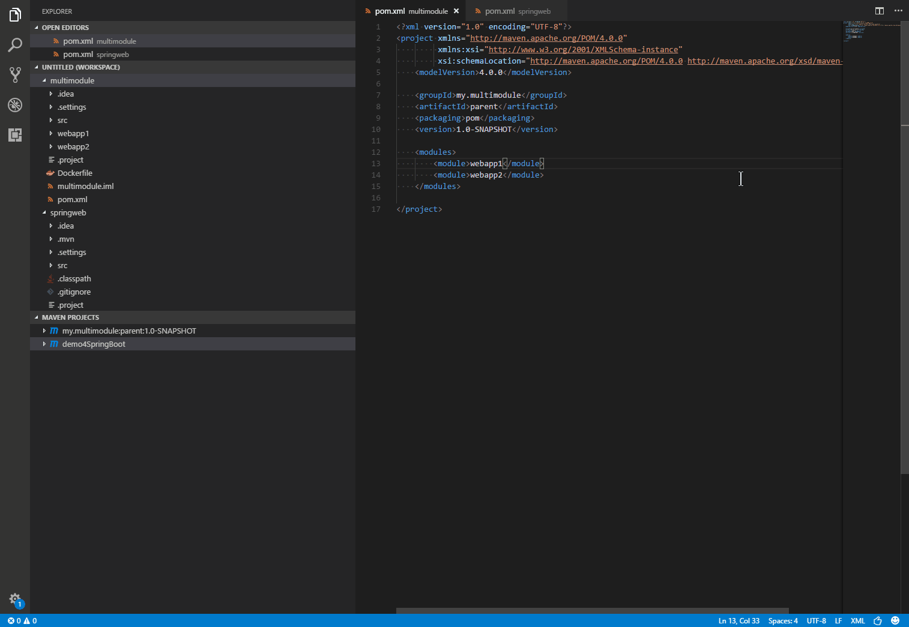
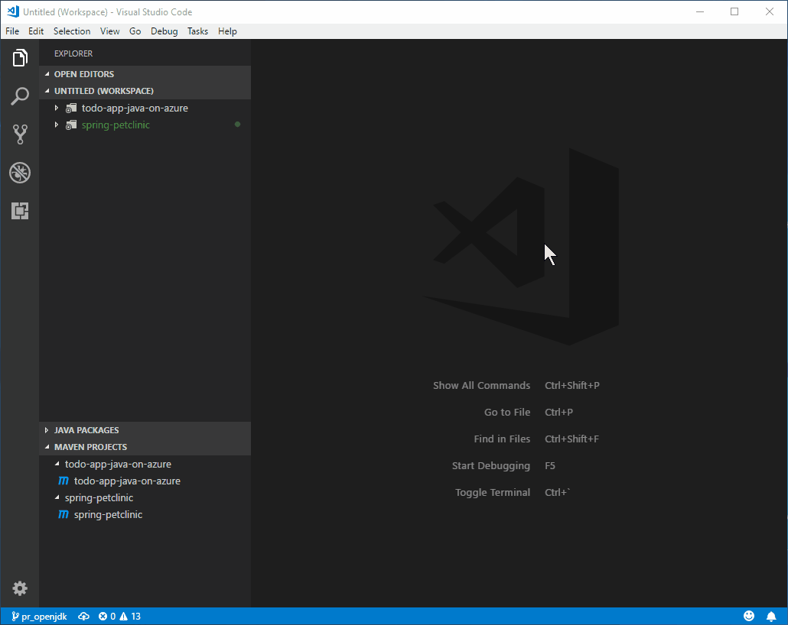

# Maven Project Explorer

   

## Features

Maven extension for VS Code. It now reads `pom.xml` in root folder, and provide project structures in sidebar.

* multi-module projects supported.
* common/custom goals can be executed via Right-Click, namely `clean`, `validate`, `compile`, `test`, `package`, `verify`, `install`, `site`, `deploy`.
* support generating effective pom.
* support VSCode multi-root workspace.

## Requirements

Maven installed and PATH added, i.e., `mvn` command can be executed directly in the terminal.

## Usage

* Basic

* Custom goals

* Archetype

## Release Notes

Refer to [CHANGELOG](CHANGELOG.md)
