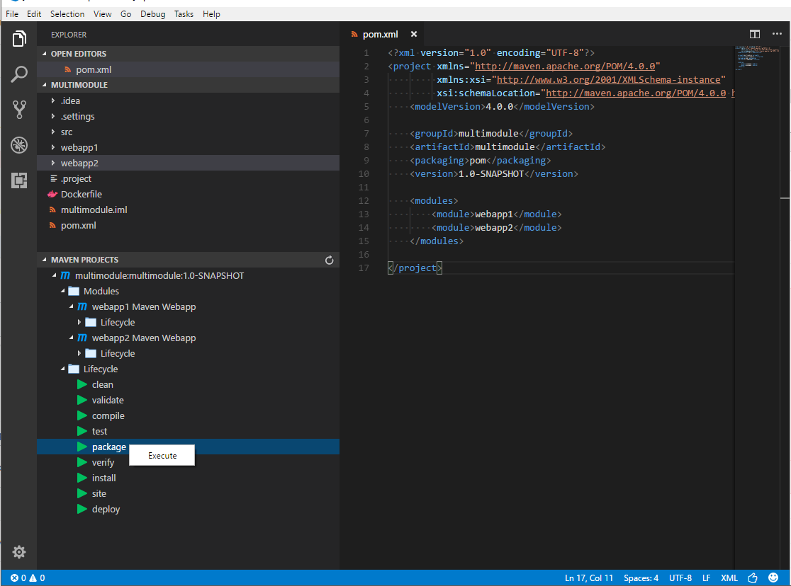
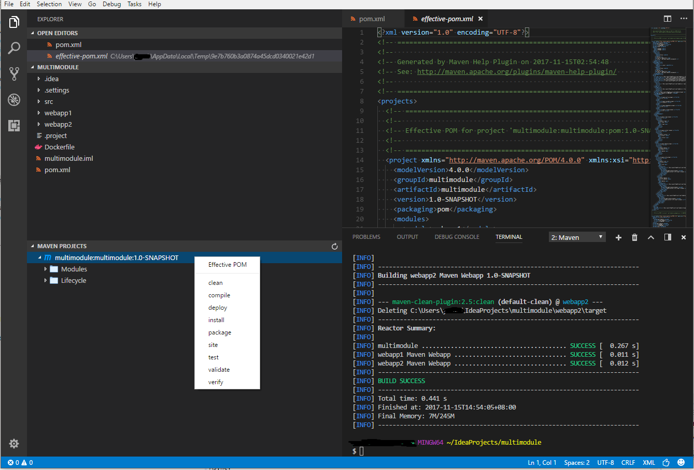

# vscode-maven README

This is the README for extension "vscode-maven".

## Features
Maven extension for VS Code. It now reads `pom.xml` in root folder, and provide project structures in sidebar.

* multi-module projects supported.
* common goals can be executed via Right-Click, namely `clean`, `validate`, `compile`, `test`, `package`, `verify`, `install`, `site`, `deploy`.

* support generating effective pom.

## Requirements

Maven installed and PATH added, i.e., `mvn` command can be executed directly in the terminal.

## Release Notes

### 0.0.1 Projects listed in sidebar.

### 0.0.2 Add icons.

### 0.0.3 Support generating effective-pom.
