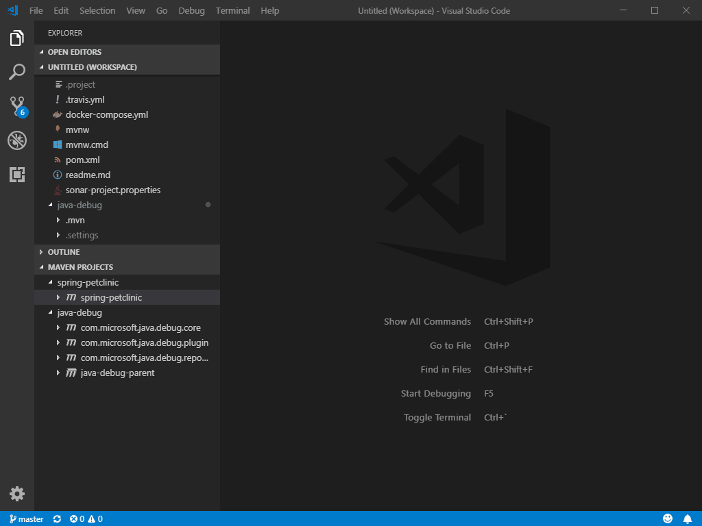

# Maven for Java

[](https://marketplace.visualstudio.com/items?itemName=vscjava.vscode-maven)
[](https://marketplace.visualstudio.com/items?itemName=vscjava.vscode-maven)
[](https://marketplace.visualstudio.com/items?itemName=vscjava.vscode-maven)
[](https://travis-ci.org/Microsoft/vscode-maven)

## Features

Maven extension for VS Code. It now reads `pom.xml` in root folder, and provide project structures in sidebar, improving user experience for Java developers who use Maven.

* Effective POM
* Shortcut to common goals, namely `clean`, `validate`, `compile`, `test`, `package`, `verify`, `install`, `site`, `deploy`.
* Perserve history of custom goals for fast re-run long commands(e.g. `mvn clean package -DskipTests -Dcheckstyle.skip`).
* Can generate projects from Maven Archetype.
* Support multi-module maven projects.
* Support VSCode multi-root workspace.

## Requirements

Provide Maven executable filepath.
* By default, `mvn` command is executed directly in the terminal, which requires `mvn` can be found in system envronment `PATH`.
* If you do not want to add it into `PATH`, you can specify maven executable path in settings:
    ```
    {
        "maven.executable.path": "/some-path-to-maven-home/bin/mvn"
    }
    ```

## Usage

* The extension scans `pom.xml` from each root folder in your workspace recursively, and display all maven projects and their modules in the sidebar.

    

* To speed up the searching of maven projects, you can exclude folders in settings:
    ```
    {
        "maven.projects.excludedFolders": [
            "**/.*",                // exclude hidden folders
            "**/node_modules",      // exclude node modules to speed up
            "**/target"             // exclude duplicated pom file in target folder
        ]
    }
    ```

* It perserves history of custom goals for each project, so you can fast re-run previous long commands, e.g. `mvn <goals> -Dparam1=value1 -Dparam2=value2 -Dparam3=value3 ...` 

    

* Archetype Related
    * **Generate from Maven Archetype** The extension loads archetypes listed in local/remote catelog. After selection, the extension fires `mvn archetype:generate -D...` in terminal.

    


## Data/Telemetry

VS Code collects usage data and sends it to Microsoft to help improve our products and services. Read our [privacy statement](http://go.microsoft.com/fwlink/?LinkId=521839) to learn more. If you don’t wish to send usage data to Microsoft, you can set the `telemetry.enableTelemetry` setting to `false`. Learn more in our [FAQ](https://code.visualstudio.com/docs/supporting/faq#_how-to-disable-telemetry-reporting).

## JAVA_HOME and Other Environment Variables

This extension executes Maven by opening a terminal session and then calling Maven in that session.
Maven requires the JAVA_HOME environment variable to be set. Maven will also look for other variables such as MAVEN_OPTS. If you prefer not to set those variables permanently you can configure them, or any other environment variable, in settings:

```
    {
        "maven.terminal.customEnv": [
            {
                "environmentVariable": "MAVEN_OPTS",               // variable name
                "value": "-Xms1024m -Xmx4096m"                     // value
            },
            {
                "environmentVariable": "JAVA_HOME",                // variable name
                "value": "C:\\Program Files\\Java\\jdk-9.0.4"      // value
            }
        ]
    }
```

### Special Handling for JAVA_HOME

If you have Red Hat's Java Language Support extension installed, then you can specify JAVA_HOME in settings for that extension:

```
    {
        "java.home": "C:\\Program Files\\Java\\jdk-9.0.4"      // Red Hat Java Language Support Setting
    }
```

This extension (Maven for Java) can reuse that setting if you desire:

```
    {
        "maven.terminal.useJavaHome": true      // Use the Red Hat Java Language Support Setting for JAVA_HOME
    }
```

With this support, you can specify JAVA_HOME in one place and you don't need to use the `maven.terminal.customEnv` setting unless
you have other environment variables to set.

If you have JAVA_HOME configured through the `maven.terminal.customEnv` setting, and also specify to reuse the Red Hat setting, then value from `maven.terminal.customEnv` will take precedent.

## Contributing

This project has adopted the [Microsoft Open Source Code of Conduct](https://opensource.microsoft.com/codeofconduct/). For more information see the [Code of Conduct FAQ](https://opensource.microsoft.com/codeofconduct/faq/) or contact [opencode@microsoft.com](mailto:opencode@microsoft.com) with any additional questions or comments.

## Release Notes

Refer to [CHANGELOG](CHANGELOG.md)
