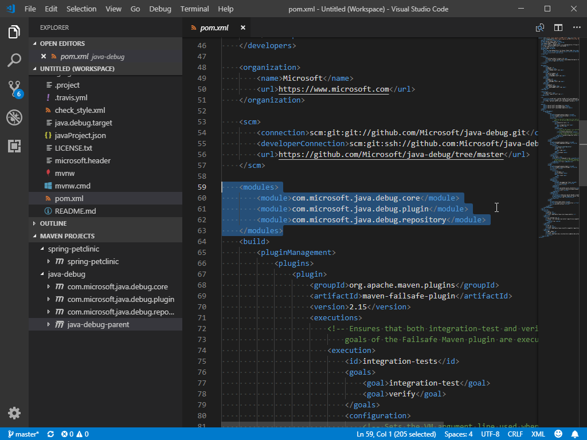
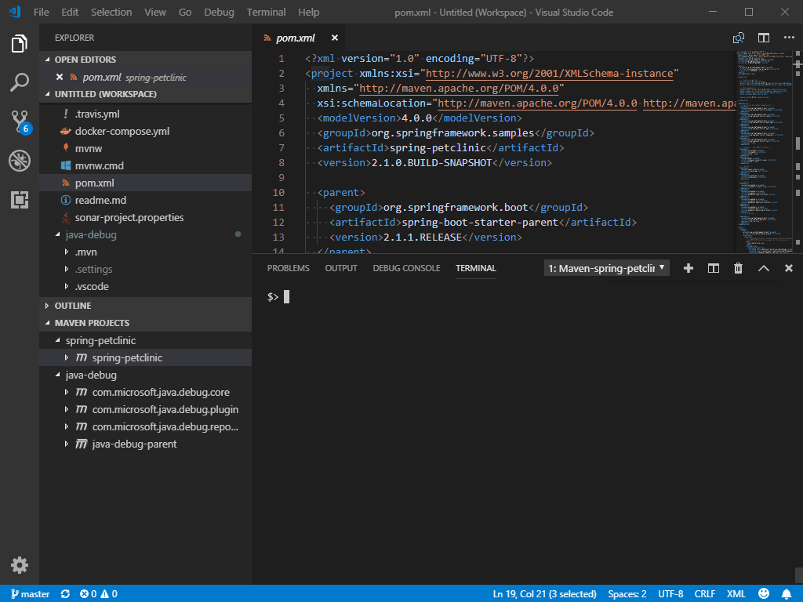

# Maven for Java

[](https://marketplace.visualstudio.com/items?itemName=vscjava.vscode-maven)
[](https://marketplace.visualstudio.com/items?itemName=vscjava.vscode-maven)
[](https://marketplace.visualstudio.com/items?itemName=vscjava.vscode-maven)
[](https://dev.azure.com/mseng/VSJava/_build/latest?definitionId=11975)

## Features

Maven extension for VS Code. It provides a project explorer and shortcuts to execute Maven commands, improving user experience for Java developers who use Maven.

* Support to generate projects from Maven Archetype.
* Support to generate effective POM.
* Provide shortcuts to common goals, plugin goals and customized commands.
* Preserve command history to fast re-run.


## Requirements
* Java
* Maven / Maven Wrapper

For troubleshooting, please refer to the page [HERE](Troubleshooting.md).

## Basic Usage
<details open>
<summary>Maven Explorer</summary>

The extension scans `pom.xml` in your workspace, and displays all Maven projects and their modules in the sidebar.



</details>

<details>
<summary>Run Plugin Goals</summary>

The extension parse effective-pom of Maven projects, and displays all plugins and plugin goals hierarchically.


</details>

<details>
<summary>POM File Editing</summary>

The extension provides Maven specific completion suggestions when editing POM files, including snippets and artifact hints.


</details>

<details>
<summary>Re-Run Historical Commands</summary>

It preserves history of goals for each project, so you can fast re-run previous long commands, e.g. `mvn <goals> -Dparam1=value1 -Dparam2=value2 -Dparam3=value3 ...`
There are 2 entries for it:
* Command Palette -> select `Maven: History ...` -> Select a project -> Select command from the history
* Right-click on a project -> Click `History ...` -> Select command from the history


</details>

<details>
<summary>Archetype Related</summary>

### Generate from Maven Archetype
The extension loads archetypes listed in local/remote catalog. After selection, the extension sends `mvn archetype:generate -D...` to terminal.
There are 2 entries for it:
* Command Palette -> select `Maven: Generate from Maven Archetype`
* Right-click on a folder -> Click `Generate from Maven Archetype`


### Update Maven Archetype Catalog
With following steps, you can update the **local cache** of Maven **remote catalog**. It takes some time to download meta data from Maven central repository.

Command Palette -> select `Maven: Update Maven Archetype Catalog`.

</details>

## Additional Configurations

<details>
<summary>JAVA_HOME and Other Environment Variables</summary>

This extension executes Maven by opening a terminal session and then calling Maven in that session.
Maven requires the JAVA_HOME environment variable to be set. Maven will also look for other variables such as MAVEN_OPTS. If you prefer not to set those variables permanently you can configure them, or any other environment variable, in settings:

```json
{
    "maven.terminal.customEnv": [
        {
            "environmentVariable": "MAVEN_OPTS",               // variable name
            "value": "-Xms1024m -Xmx4096m"                     // value
        },
        {
            "environmentVariable": "JAVA_HOME",                // variable name
            "value": "C:\\Program Files\\Java\\jdk-9.0.4"      // value
        }
    ]
}
```
</details>

<details>
<summary>Special Handling for JAVA_HOME</summary>

If you have Red Hat's Java Language Support extension installed, then you can specify JAVA_HOME in settings for that extension:

```json
{
    "java.home": "C:\\Program Files\\Java\\jdk-9.0.4"      // Red Hat Java Language Support Setting
}
```

This extension (Maven for Java) can reuse that setting if you desire:

```json
{
    "maven.terminal.useJavaHome": true      // Use the Red Hat Java Language Support Setting for JAVA_HOME
}
```

With this support, you can specify JAVA_HOME in one place and you do not need to use the `maven.terminal.customEnv` setting unless
you have other environment variables to set.

If you have JAVA_HOME configured through the `maven.terminal.customEnv` setting, and also specify to reuse the Red Hat setting, then the value from `maven.terminal.customEnv` will take precedence.

</details>

<details>
<summary>Default Options for Maven Command</summary>
The usage of Maven executable is:

> usage: mvn [options] [<goal(s)>] [<phase(s)>]

You can use `maven.executable.options` to specify default **options** for all your Maven commands executed in current project.
```json
{
    "maven.executable.options": "-o -s ./settings.xml"      // work offline, and use an alternative settings file
}
```
</details>

<details>
<summary>Folder Exclusion for Searching POM Files</summary>

To speed up the searching of Maven projects, you can exclude folders in settings:

```json
{
    "maven.excludedFolders": [
        "**/.*",                // exclude hidden folders
        "**/node_modules",      // exclude node modules to speed up
        "**/target"             // exclude duplicated pom file in target folder
    ]
}
```
</details>

<details>
<summary>Customize Favorite Maven Commands</summary>

Specify a favorite command in settings:

```json
{
    "maven.terminal.favorites": [
        {
            "alias": "full-build without tests",
            "command": "clean package -DskipTests"
        }
    ]
}
```

Now right-click on an project item, and then click `Favorite ...`. The option `full-build without tests` should show up.

</details>

## Settings

| Name | Description | Default Value |
|---|---|---|
| `maven.dependency.enableConflictDiagnostics` | Specify whether to show diagnostics for conflict dependencies. | `true` |
| `maven.excludedFolders` | Specifies file path pattern of folders to exclude while searching for Maven projects. | `[ "**/.*", "**/node_modules", "**/target", "**/bin", "**/archetype-resources" ]` |
| `maven.executable.preferMavenWrapper` | Specifies whether you prefer to use Maven wrapper. If true, it tries using 'mvnw' by walking up the parent folders. If false, or 'mvnw' is not found, it tries 'mvn' in PATH instead. | `true` |
| `maven.executable.path` | Specifies absolute path of your 'mvn' executable. When this value is empty, it tries using 'mvn' or 'mvnw' according to the value of 'maven.executable.preferMavenWrapper'. E.g. `/usr/local/apache-maven-3.6.0/bin/mvn` | ` ` |
| `maven.executable.options` | Specifies default options for all mvn commands. E.g. `-o -DskipTests` | ` ` |
| `maven.explorer.projectName` | Format of project node name shown in Maven explorer. | `${project.name}` |
| `maven.projectOpenBehavior` | "Default method of opening newly created project. | `"Interactive"` |
| `maven.pomfile.autoUpdateEffectivePOM` | Specifies whether to update effective-pom automatically whenever changes detected. | `false` |
| `maven.pomfile.globPattern` | Specifies the glob pattern used to look for pom.xml files. | `**/pom.xml` |
| `maven.pomfile.prefetchEffectivePom` | Specifies whether to prefetch effective pom on startup. | `false` |
| `maven.terminal.useJavaHome` | If this value is true, and if the setting java.home has a value, then the environment variable JAVA_HOME will be set to the value of java.home when a new terminal window is created. | `false` |
| `maven.terminal.customEnv` | Specifies an array of environment variable names and values. These environment variable values will be added before Maven is executed. <br /> `environmentVariable`: Name of the environment variable to set. <br /> `value`: Value of the environment variable to set. | `[]` |
| `maven.terminal.favorites` | Specify pre-defined favorite commands to execute. <br /> `alias`: A short name for the command. <br /> `command`: Content of the favorite command. | `[]` |
| `maven.view` | Specifies the way of viewing Maven projects. Possible values: `flat`, `hierarchical`. | `flat` |
| `maven.settingsFile` | Specifies the absolute path of Maven `settings.xml` file. If not specified, `~/.m2/settings.xml` is used. | `null` |
| `maven.showInExplorerContextMenu` | If this value is true, add a command to create Maven Projects in the Explorer context menu for folders. | `true` |

## Data/Telemetry

VS Code collects usage data and sends it to Microsoft to help improve our products and services. Read our [privacy statement](http://go.microsoft.com/fwlink/?LinkId=521839) to learn more. If you don’t wish to send usage data to Microsoft, you can set the `telemetry.enableTelemetry` setting to `false`. Learn more in our [FAQ](https://code.visualstudio.com/docs/supporting/faq#_how-to-disable-telemetry-reporting).

## Contributing

This project has adopted the [Microsoft Open Source Code of Conduct](https://opensource.microsoft.com/codeofconduct/). For more information see the [Code of Conduct FAQ](https://opensource.microsoft.com/codeofconduct/faq/) or contact [opencode@microsoft.com](mailto:opencode@microsoft.com) with any additional questions or comments.

## Release Notes

Refer to [CHANGELOG](CHANGELOG.md)
